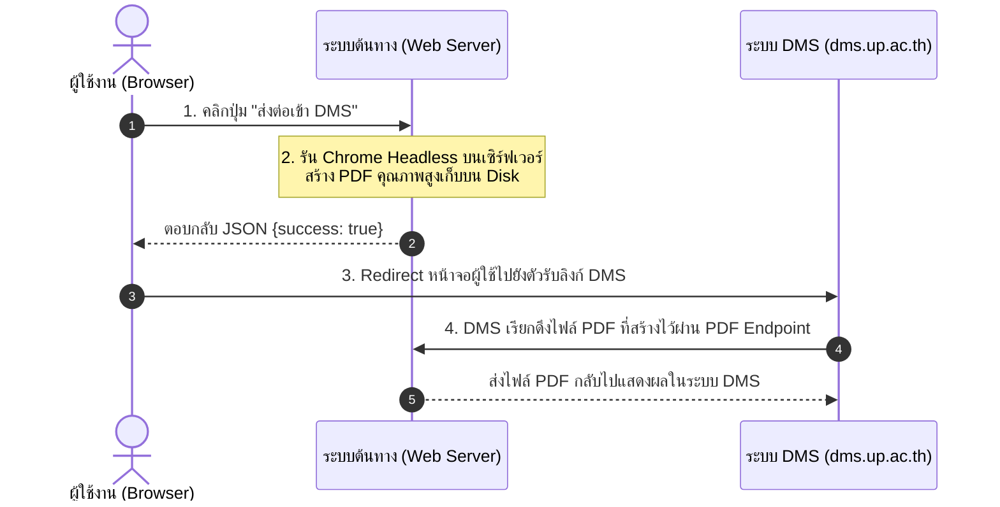

# 🛠️ คู่มือสถาปัตยกรรมการเชื่อมต่อระบบงานกับระบบ DMS (มหาวิทยาลัยพะเยา)

คู่มือนี้สรุปขั้นตอนและสถาปัตยกรรม (Architecture) ในการเชื่อมต่อระบบงานภายในกับระบบ DMS ของมหาวิทยาลัยพะเยา เพื่อส่งและแสดงผลไฟล์เอกสาร PDF บนระบบสารบรรณอิเล็กทรอนิกส์ (DMS) อย่างมีประสิทธิภาพ ป้องกันปัญหาการเกิด Connection Timeout

---

## 📊 แผนภาพขั้นตอนการเชื่อมต่อ (Sequence Diagram)



---

## 📝 รายละเอียดขั้นตอนการดำเนินงาน

### ขั้นตอนที่ 1: เตรียมปุ่มส่งข้อมูลบนหน้าจอระบบต้นทาง (Client-side Trigger)
บนหน้าจอรายละเอียดเอกสารของระบบต้นทาง ให้พัฒนาการทำงานฝั่ง Front-end ดังนี้:
1. เมื่อผู้ใช้คลิกปุ่มส่งข้อมูลเข้า DMS ให้ส่งคำขอแบบ **AJAX / Fetch API** ไปยังเซิร์ฟเวอร์ก่อนแทนการย้ายหน้าจอบราวเซอร์ทันที
2. ล็อคปุ่มกดชั่วคราวเพื่อป้องกันการกดซ้ำ และแสดงสถานะการโหลด เช่น *"กำลังสร้างและบันทึกเอกสาร PDF..."* เพื่อให้ผู้ใช้งานทราบสถานะ

---

### ขั้นตอนที่ 2: แปลงเอกสารเป็น PDF บนเซิร์ฟเวอร์ (Server-side PDF Generation)
สร้างสคริปต์หลังบ้าน (เช่น `print_booking_pdf.php?ref=[ID]&generate=1`) ทำหน้าที่รับคำสั่งจาก Front-end เพื่อสร้างไฟล์ PDF บนดิสก์ของเซิร์ฟเวอร์:
1. **รันคำสั่ง Chrome Headless ด้วยพารามิเตอร์ที่เหมาะสม:**
   การรันคำสั่งสั่งงานเบราว์เซอร์ผ่านบริการเว็บเซิร์ฟเวอร์ (เช่น IIS หรือ Apache) มักเกิดการค้าง (Hang) จากการทำงานในระบบ Session 0 ที่ไร้หน้าจอ (Non-interactive) จำเป็นต้องรันคำสั่ง Chrome ด้วย Flag เหล่านี้เสมอ:
   ```cmd
   chrome.exe --headless=new --print-background --print-to-pdf-no-header --user-data-dir="[โฟลเดอร์ Profile ชั่วคราวแยกเฉพาะ]" --print-to-pdf="[ที่อยู่เซฟไฟล์ PDF]" "[ลิงก์หน้าเว็บ HTML ต้นทาง]"
   ```
   * `--headless=new` : สั่งงาน Chrome โหมดไร้หน้าจอเวอร์ชันใหม่ที่มีความเสถียรสูงกว่าเดิม
   * `--print-background` : เปิดใช้งานการวาดสีพื้นหลัง รูปภาพ และเครื่องหมายกล่องตัวเลือก (Checkboxes)
   * `--print-to-pdf-no-header` : ปิดหัวกระดาษและท้ายกระดาษเริ่มต้น (ลบวันที่, URL, และการใส่เลขหน้า 1/1 ออก)
   * `--user-data-dir` : แยกโฟลเดอร์สำหรับเขียนไฟล์ประมวลผลของบราวเซอร์ ป้องกันการเกิด Lock สิทธิ์
2. เมื่อสร้างไฟล์ PDF สำเร็จ ให้ตอบกลับ JSON กลับไปยัง Front-end เป็น `{"success": true}`

---

### ขั้นตอนที่ 3: เปลี่ยนหน้าจอผู้ใช้ไปยังระบบ DMS (DMS Redirect Connection)
เมื่อตัวบราวเซอร์ได้รับผลลัพธ์ว่าระบบหลังบ้านสร้าง PDF ลงดิสก์สำเร็จแล้ว ให้ทำการเปลี่ยนเส้นทางหน้าเว็บ (Redirect) ผู้ใช้ไปยังตัวเชื่อมต่อของ DMS:
* **URL โครงสร้างเชื่อมต่อระบบ DMS:**
  `https://dms.up.ac.th/dms_main/data/ck_link_conect.aspx?ref=[รหัสอ้างอิงเอกสาร]&con=[รหัสรันระบบ]&sub=[รหัสย่อย]`
  *(ตัวอย่างระบบขอรถ: `con=8025&sub=34`)*
* ขั้นตอนนี้จะเป็นการนำหน้าจอของผู้ใช้เพื่อไปสู่ระบบ DMS เพื่อลงทะเบียนเอกสารรหัสดังกล่าวต่อไป
* ค่า `con` และ `sub` ได้จากการตั้งค่าการเชื่อมต่อในระบบ DMS (ดู[ขั้นตอนที่ 5](#ขั้นตอนที่-5-ตั้งค่าการเชื่อมต่อในระบบ-dms-เพื่อรับค่า-con-และ-sub))

---

### ขั้นตอนที่ 4: สร้าง PDF Endpoint เพื่อส่งไฟล์ให้กับ DMS (Serve PDF to DMS)
เมื่อผู้ใช้งานเข้าสู่หน้าจอ DMS แล้ว ระบบฝั่งของ DMS จะทำการยิง HTTP Request กลับมาหาเซิร์ฟเวอร์ต้นทางของเรา ณ **Connect Path** ที่กำหนดไว้ เพื่อนำไฟล์ PDF ไปบันทึกเก็บในฐานข้อมูลกลางของ DMS โดยมีค่าดังนี้:

* **Connect Path ที่ต้องนำไปลงทะเบียนในระบบ DMS:**
  * **ระบบขออนุญาตใช้รถตู้ (con=8025, sub=34):**
    `https://www.medsci.up.ac.th/car_booking/print_booking_pdf.php?ref={ref}`
  * **ระบบขออนุมัติค่าน้ำมันเชื้อเพลิง (con=8026, sub=36):**
    `https://www.medsci.up.ac.th/car_booking/print_fuel_pdf.php?ref={ref}`
  * **ระบบขออนุมัติใช้ห้องเรียน (con=8041, sub=52)** — ใช้ร่วมกันทั้งแบบฟอร์ม Active Learning Classroom และห้องเรียน/Hybrid Classroom:
    `https://www.medsci.up.ac.th/eform/print_booking_pdf.php?ref={ref}`

1. **ออกแบบไฟล์ Endpoint ให้มีหน้าที่หลักคือเช็คและส่งไฟล์:**
   * สคริปต์จะทำการค้นหาว่ามีไฟล์ PDF ที่ประมวลผลเสร็จแล้วบนดิสก์อยู่แล้วหรือไม่
   * **กรณีมีไฟล์แล้ว (เกิดจากการกดปุ่มในขั้นตอนที่ 1-2):** สคริปต์จะส่งไฟล์ PDF กลับไปให้ DMS ทันที ซึ่งจะทำงานเสร็จสิ้นภายในเวลาน้อยกว่า 1 วินาที ป้องกันปัญหา DMS ค้างหรือรอเชื่อมต่อจนเกิด Timeout ได้อย่างสมบูรณ์
   * **กรณีไม่มีไฟล์บนดิสก์ (เป็นระบบสำรองกรณีฉุกเฉิน):** ให้เรียกฟังก์ชันรัน Chrome Headless เพื่อสร้างไฟล์ขึ้นมาใหม่ หรือคืนหน้าแสดงผลคำแนะนำให้ผู้ใช้กดยืนยันอัปโหลดก่อน

---

### ขั้นตอนที่ 5: ตั้งค่าการเชื่อมต่อในระบบ DMS เพื่อรับค่า con และ sub
หลังจากสร้างแบบฟอร์มในระบบต้นทางเสร็จแล้ว ให้ไปตั้งค่าการเชื่อมต่อ DMS ที่:

**https://dms.up.ac.th/dms_main/data/connect_edit.aspx**

1. เข้าสู่ระบบ DMS แล้วเปิดหน้าตั้งค่าการเชื่อมต่อตามลิงก์ข้างต้น
2. ลงทะเบียน **Connect Path** ของแต่ละแบบฟอร์ม (URL ของ PDF Endpoint ในขั้นตอนที่ 4) เช่น
   `https://www.medsci.up.ac.th/eform/print_booking_pdf.php?ref={ref}`
3. นำค่า **con** (รหัสรันระบบ) และ **sub** (รหัสย่อย) ที่ได้จาก DMS มาใช้ใน URL ขั้นตอนที่ 3
   * ระบบขอใช้ห้องเรียน: กรอกใน `config.php` ที่ `dms.forms.alc` (ห้อง Active Learning Classroom) และ `dms.forms.classroom` (ห้องเรียน / Hybrid Classroom) แบบฟอร์มละหนึ่งชุด

---

## 💡 แนวทางการตั้งค่าและข้อควรระวัง (Tips & Best Practices)

1. **สิทธิ์ของโฟลเดอร์เขียน Profile ชั่วคราว (Chrome Profile Folder):**
   ตรวจสอบให้แน่ใจว่าโฟลเดอร์ที่กำหนดใน `--user-data-dir` (เช่น โฟลเดอร์ `uploads/dms/chrome_profile` ภายใต้โปรเจกต์) ได้รับการแชร์สิทธิ์การเขียนแบบ **Full Control / Modify** ให้กับบัญชีผู้ใช้ที่เป็นเจ้าของโปรเซสเว็บเซิร์ฟเวอร์ (เช่น `IIS_IUSRS` หรือ `DefaultAppPool` ในระบบปฏิบัติการ Windows)
2. **การทำ Pre-generation (สร้างเอกสารเก็บไว้ล่วงหน้า):**
   การแปลงเอกสารขนาดใหญ่จาก HTML เป็น PDF เป็นกระบวนการที่กินแรมและ CPU สูงมาก การใช้วิธีสร้างไฟล์รอไว้ล่วงหน้าเมื่อผู้ใช้กดยืนยันแล้วส่งต่อ (Pre-generated flow) จะช่วยลดทราฟฟิกรันพร้อมกันบนเซิร์ฟเวอร์ได้ดีกว่าการแปลงสดขณะระบบภายนอกเรียกเข้ามาอย่างมาก
3. **การออกแบบสไตล์ชีทสำหรับสื่อสิ่งพิมพ์ (Print CSS):**
   ในการรัน Chrome เพื่อแปลงหน้าเอกสารเป็น PDF ตัว Chrome จะอ้างอิงชุดคำสั่ง CSS ในส่วนของ `@media print` เป็นหลัก ดังนั้นให้ตกแต่งหน้ากระดาษ ขนาดฟอนต์ ความกว้าง ระยะขอบ และการซ่อนปุ่มไม่พึงประสงค์ (ใช้ `.no-print { display: none !important; }`) ไว้ภายใต้บล็อค `@media print` เสมอ
